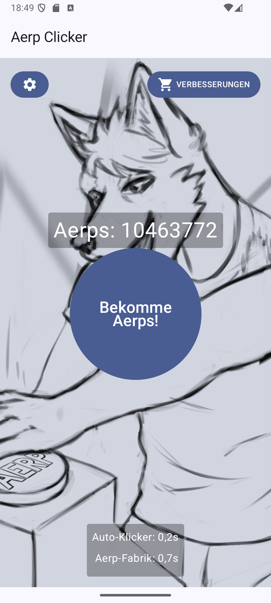
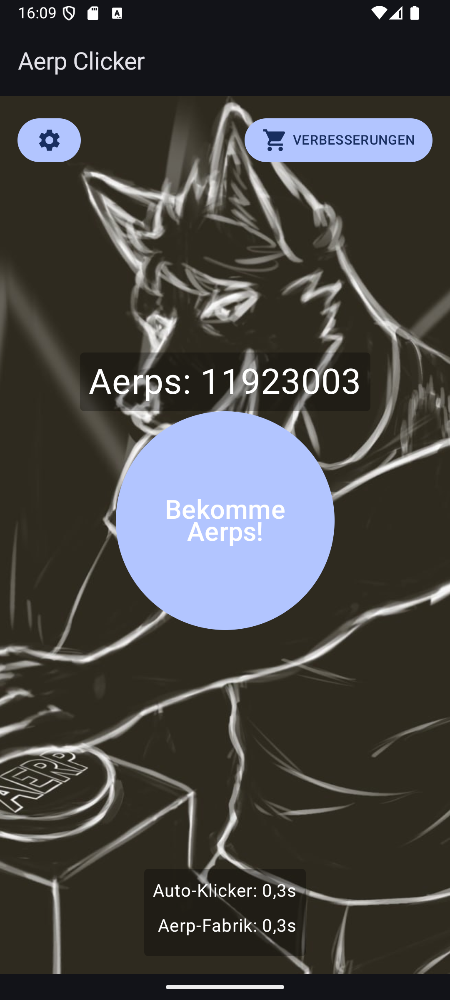

# Aerp Clicker 🎮

A simple yet addictive clicker game for Android, developed with Jetpack Compose! Click your way to riches, buy upgrades, and optimize your Aerp production.

## ✨ Features

*   **Classic Clicker Gameplay:** Click the button to earn "Aerps" (the in-game currency).
*   **Shop System:** Buy various upgrades to increase your Aerp earnings per click or your automatic production.
    *   **Click Boosts:** Increases the number of Aerps per manual click.
    *   **Auto-Clicker:** Automatically generates Aerps over time.
    *   **Aerp Factories:** Continuously produce Aerps.
    *   **Further Enhancements:** Discover upgrades for intervals, production amounts, and more!
*   **Dynamic Costs:** The cost of upgrades increases with each purchase.
*   **Multi-level Upgrades:** Many items can be upgraded multiple times.
*   **Dark Mode Support:** The app automatically adapts to your Android system's light or dark theme.
*   **Modern UI:** Developed with Jetpack Compose for a declarative and responsive user interface.
*   **Localization:** Available in German and English.

## 📸 Screenshots

| Light Mode | Dark Mode |
|---|---|
|  |  |

## 🛠️ Built With

*   [Kotlin](https://kotlinlang.org/)
*   [Android Jetpack](https://developer.android.com/jetpack)
    *   [Jetpack Compose](https://developer.android.com/jetpack/compose) for the UI
    *   [ViewModel](https://developer.android.com/topic/libraries/architecture/viewmodel) for UI logic and state management
    *   [Material Design 3](https://m3.material.io/) Components
*   [Gradle](https://gradle.org/) for the build system

## 🚀 Getting Started

To get a local copy up and running, follow these simple steps.

### Prerequisites

*   Android Studio Iguana | 2023.2.1 or later
*   Gradle 8.0 or later

## 🤝 Contributing

Contributions are what make the open-source community such an amazing place to learn, inspire, and create. Any contributions you make are **greatly appreciated**.

If you have a suggestion that would make this better, please fork the repo and create a pull request. You can also simply open an issue with the tag "enhancement".
Don't forget to give the project a star! Thanks again!

1.  Fork the Project
2.  Create your Feature Branch (`git checkout -b feature/AmazingFeature`)
3.  Commit your Changes (`git commit -m 'Add some AmazingFeature'`)
4.  Push to the Branch (`git push origin feature/AmazingFeature`)
5.  Open a Pull Request

## 📄 License

Distributed under the MIT License. See `LICENSE` for more information.
